# Legatum Internacional — Immigration Advisory Website

A immigration/visa consultancy competes for search traffic against two opposites:
government sites (which rank for free, on informational intent) and "coyote"
gestorías that promise a guaranteed visa (which Google Ads suspends and clients
distrust). This repository is the marketing and lead-generation site built to win
the middle ground — the client who doesn't trust the coyote but doesn't want to
navigate the process alone — for **Legatum Internacional**, a Durango-based
immigration advisory firm.

It's an [Astro](https://astro.build) static site deployed as a single Cloudflare
Worker: every page is pre-rendered HTML served from the edge, and the one route
that needs a server (the newsletter/lead-magnet signup) is a hand-written fetch
handler in front of [Brevo](https://www.brevo.com). No framework backend, no
database, no adapter — the architecture is sized to what a content-and-forms site
actually needs.

---

## Project status

| | |
|---|---|
| **Live site** | https://www.legatum-internacional.com |
| **Stack** | Astro 6 (static output) · Cloudflare Workers (assets + one fetch handler) |
| **Deploy** | `npm run deploy` → `astro build` then `wrangler deploy` |
| **Content** | 5 static services, 11 blog posts (Astro content collections), 4 interactive tools, 2 ad landing pages |
| **License** | Proprietary — © Legatum Internacional. Not open source. |

---

## What's actually in this repository

Two things live side by side here, deliberately:

1. **The site** (`src/`, `public/`, `scripts/`) — the Astro codebase described below.
2. **`ai/`** — a full strategic audit (Google Ads risk, keyword strategy, SEO,
   architecture review, copywriting, user psychology, funnel/CRO, WhatsApp
   strategy, authority/trust building, a 3/6/12-month growth plan, and a master
   execution roadmap that sequences all of it into actionable tasks) plus a
   foundational document defining the firm's identity, buyer personas, and SOPs.

   That folder isn't documentation of the code — it's the reasoning behind
   product decisions that *aren't* visible in a diff: why the pricing is
   published instead of hidden behind "contact us," why the site's honesty about
   *not* guaranteeing visa approval is treated as the primary brand asset rather
   than a conversion-rate problem, why WhatsApp is a first-class channel instead
   of an afterthought. Several sections of this README (the tracking events, the
   landing pages, the lead-magnet popup) exist because of tasks defined there.

---

## Architecture

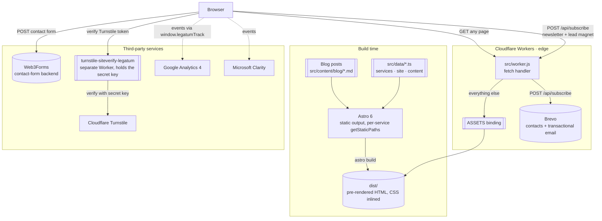

### Why there's no Astro adapter

`@astrojs/cloudflare` is in `package.json` (it's what generates the Worker
runtime types via `wrangler types`), but `astro.config.mjs` never registers it as
an `adapter`. The build output is 100% static HTML — there is no
`Astro.locals`, no on-request rendering, nothing that needs a server per page.

`wrangler.jsonc` points a Worker directly at the built assets:

```jsonc
{
  "main": "src/worker.js",
  "assets": { "directory": "./dist", "binding": "ASSETS" }
}
```

`src/worker.js` is a ~15-line fetch handler: if the request is
`POST /api/subscribe`, handle it; for everything else, hand the request to the
`ASSETS` binding, which serves the static build with Cloudflare's own edge
caching. One route pays for Worker execution; every other page is a cache hit.
`public/.assetsignore` excludes `_worker.js`/`_routes.json` from the asset
manifest, since routing is handled explicitly by the one worker script instead
of Cloudflare Pages' file-based conventions.

The contact form itself needs no server at all: it posts directly from the
browser to Web3Forms, so the one Worker route exists only for the flows that
touch Brevo.

---

## Content architecture

Two different content models coexist, chosen per what the content actually is:

| | Where | Why |
|---|---|---|
| **Blog posts** | Astro content collections (`src/content/blog/*.md`, schema in `src/content.config.ts`) | Prose with front-matter (title, `pubDate`, `pillarService`, inline `faqs`) — the collections API gives type-checked front-matter and file-based routing for free. |
| **Services, pricing, testimonials, FAQs, process steps** | Plain typed modules (`src/data/services.ts`, `content.ts`, `site.ts`) | Structured business records, not documents — no reason to parse Markdown front-matter for an array of 5 service objects. Editing a fee or an FAQ answer is a one-line diff in a `.ts` file, and every consumer gets full type inference. |

`services.ts` is the single source of truth for the service catalog. One array
entry drives, without duplication:

- the service detail page at `/servicios/[slug]/` (`getStaticPaths()` generates
  one static page per entry, including its `Service` + `Offer` JSON-LD with real
  MXN pricing),
- the `<select>` options in the contact form,
- `sitemap.xml.ts`,
- the "related guides" cross-links on both the service page and the blog post.

Change a price or add a service once; every surface that quotes it updates on
the next build.

---

## SEO layer

`src/components/SEO.astro` + `src/seo/schema.ts` build a JSON-LD `@graph` per
page: `Organization`, `Person` (the named founder — deliberate, since a firm
handling government paperwork benefits from a real, attributable person rather
than an anonymous brand), and on the homepage additionally `WebSite`, `WebPage`,
and a `LocalBusiness`/`ProfessionalService` entry scoped to Durango with
`areaServed` covering Mexico, the US, and Canada. Every service page adds its own
`Service` node with real pricing as an `Offer`.

Two search-engine verification files sit in `public/` (`BingSiteAuth.xml`, and a
`msvalidate.01` meta tag in `SEO.astro`) alongside the Google-side signals — both
engines matter for a Mexico-based, Spanish-language local business.

`sitemap.xml.ts` is a hand-written endpoint rather than a plugin: it needed
custom logic (service pages from `services.ts`, blog pages from the content
collection with a `try/catch` for the pre-blog era, and per-URL priority/
changefreq tuned by page type) that a generic sitemap integration wouldn't give
without fighting it.

### Landing pages are deliberately excluded from the index

`src/pages/lp/*.astro` render through `LpLayout.astro` instead of the normal
`BaseLayout` + `Navbar` + `Footer`: no site navigation (nothing to click away
to), a persistent mobile-only sticky WhatsApp bar, and a `noindex, nofollow`
meta tag. These pages exist only as landing targets for paid traffic — indexing
them would create thin, ad-copy-driven duplicate content competing with the
real service pages for the same keywords.

---

## Lead-generation funnel

There are two independent lead paths, each hitting a different backend, plus a
tracking layer that's blind to neither.

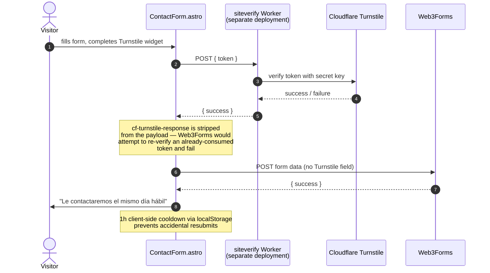

Web3Forms has no server-side Turnstile integration, so bot-protection is layered
in front of it manually: the widget's token is verified against **our own**
Cloudflare Worker (which holds the Turnstile secret key — never exposed to the
browser), and only after that succeeds does the (now-Turnstile-stripped) form
get submitted to Web3Forms. Consuming the same token twice would fail Turnstile's
one-time-use check, which is why the field is deleted before the second POST.

The second path — the newsletter form and the scroll-triggered DS-160
lead-magnet popup — both call this repo's own `/api/subscribe` Worker route,
which upserts the contact into Brevo and, only when the source is the popup,
sends a branded transactional email with the guide PDF attached
(`src/worker.js`). `LeadMagnetPopup.astro` triggers at 30% scroll depth (no
timer — a visitor who hasn't scrolled hasn't shown intent yet), remembers
dismissal for the session via `sessionStorage`, and is turned off entirely on
landing pages (`hidePopup` on `BaseLayout`) since ad traffic gets one CTA, not two
competing ones.

### Tracking

`window.legatumTrack(name, params)` (defined in `Clarity.astro`) is the single
entry point both analytics providers listen through — Google Analytics 4
(`GoogleAnalytics.astro`) and Microsoft Clarity are both loaded on
`requestIdleCallback` after `load`, off the critical rendering path. Three
events matter enough to be wired explicitly:

| Event | Trigger | Why |
|---|---|---|
| `whatsapp_click` | Global click delegation on any `a[href*="wa.me"]` (`public/scripts/site.js`) | Delegated at the document level so a new WhatsApp button added anywhere later is tracked automatically — no per-component wiring to forget. |
| `scroll_to_contact` | `IntersectionObserver` on `#contacto`, fires once | A scroll-into-view is a funnel-intent signal even without a click. |
| `generate_lead` | Contact form success | Tagged with the selected service, so ad spend can eventually be attributed to service-level conversion, not just site-wide leads. |

---

## Security headers

`public/_headers` (Cloudflare's native `_headers` file convention) sets a
`Content-Security-Policy` that is a strict allow-list of exactly the domains
this site talks to — Clarity, Bing, Web3Forms, Turnstile, and the siteverify
Worker — plus HSTS with `preload`, `X-Frame-Options: DENY`,
`X-Content-Type-Options: nosniff`, and a `Permissions-Policy` that blocks
camera/microphone/geolocation/payment outright, since none are ever needed.
Static assets (`_astro/*`, icons, fonts) get long, immutable `Cache-Control`;
the video testimonials get a shorter max-age with `Accept-Ranges: bytes` so
Safari's range requests for `<video>` scrubbing work correctly.

---

## Performance decisions

- **`build: { inlineStylesheets: 'always' }`** — every page's CSS is inlined
  instead of a separate `<link>`, removing a render-blocking round-trip. The
  trade-off (no cross-page CSS caching) is the right one for a marketing site
  where most visitors land on one page from search or an ad and leave.
- **Fonts API with self-hosting + fallback metrics** — `astro.config.mjs`
  configures Cormorant Garamond and Jost through `fontProviders.fontsource()`
  with explicit `fallbacks` (Georgia/Times New Roman, Avenir Next/Segoe UI).
  Astro's Fonts API computes fallback metrics automatically so the fallback
  font occupies the same box as the webfont — the goal is CLS ≈ 0 while the
  real font loads, without a FOUT/FOIT trade-off decision left to chance.
- **Icons and the PDF lead magnet are generated, not hand-exported** —
  `scripts/gen-favicon.mjs` rasterizes `favicon.svg` via `sharp` into a
  multi-resolution `.ico`, and `scripts/gen-guia-ds160.mjs` builds the "7 DS-160
  errors" PDF programmatically with `pdfkit` (brand colors, layout, and copy as
  code). Both keep a single source of truth instead of a designer-exported
  binary asset that silently drifts from the brand file.

---

## Repository layout

```text
legatum-web/
├── astro.config.mjs         → Static output, MDX, self-hosted Fonts API
├── wrangler.jsonc           → Worker name, entry point, assets binding
├── package.json             → dev · build · preview (wrangler dev) · deploy
│
├── ai/                      → Strategic audit & foundational docs (see above)
│
├── scripts/
│   ├── gen-favicon.mjs      → SVG → multi-res .ico via sharp
│   └── gen-guia-ds160.mjs   → Generates the DS-160 lead-magnet PDF via pdfkit
│
├── src/
│   ├── worker.js            → The one dynamic route: POST /api/subscribe → Brevo
│   ├── data/
│   │   ├── site.ts          → Site config, fees, founder, nav — obfuscated email
│   │   ├── services.ts      → Service catalog: single source of truth
│   │   └── content.ts       → Testimonials, FAQs, case studies, process steps
│   ├── seo/schema.ts        → JSON-LD @graph builder (Organization/Person/…)
│   ├── content.config.ts    → Blog collection schema (Zod)
│   ├── content/blog/        → 11 Markdown posts
│   ├── layouts/
│   │   ├── BaseLayout.astro → SEO, fonts, analytics, lead-magnet popup
│   │   └── LpLayout.astro   → No nav, noindex, sticky mobile WhatsApp — ad LPs
│   ├── components/
│   │   ├── ContactForm.astro     → Web3Forms + Turnstile verification dance
│   │   ├── NewsletterForm.astro  → → /api/subscribe
│   │   ├── LeadMagnetPopup.astro → Scroll-triggered DS-160 guide popup
│   │   └── analytics/            → Clarity.astro, GoogleAnalytics.astro
│   ├── sections/            → Home page sections (Hero, Method, Trust, FAQ…)
│   └── pages/
│       ├── index.astro
│       ├── servicios/[slug].astro     → getStaticPaths over services.ts
│       ├── blog/[slug].astro          → getStaticPaths over the collection
│       ├── herramientas/              → 4 interactive client-side tools
│       ├── lp/                        → Ad-only landing pages (noindex)
│       └── sitemap.xml.ts             → Hand-written, priority-tuned sitemap
│
└── public/
    ├── _headers             → CSP, HSTS, cache policy
    ├── guia-ds160.pdf       → Generated by scripts/gen-guia-ds160.mjs
    └── robots.txt           → Disallow: /api/
```

---

## Running it

```bash
npm install
npm run dev          # astro dev — localhost:4321

npm run build        # astro build → dist/
npm run preview      # build, then wrangler dev against the real Worker

npm run generate-types  # wrangler types — Env types for src/worker.js
npm run deploy        # build, then wrangler deploy
```

### Secrets

The Worker needs one secret Astro's own dev server never touches, since it only
matters for `/api/subscribe`:

```bash
wrangler secret put BREVO_API_KEY
```

Everything else (Turnstile site key, GA4/Clarity IDs, Web3Forms access key) is
a public client-side identifier and is committed as plain values in the
relevant components — none of it is a credential that grants write access
without also holding the corresponding server-side secret.

### Regenerating derived assets

```bash
node scripts/gen-favicon.mjs      # requires: npm i -D sharp
node scripts/gen-guia-ds160.mjs   # pdfkit is already a dependency
```

---

## The interface

| Home — hero | Home — services grid |
| :---: | :---: |
| 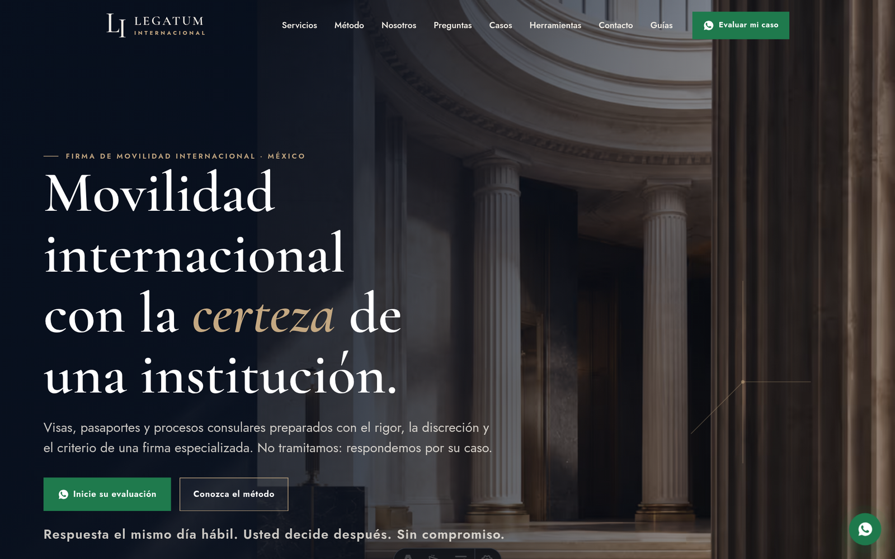 | 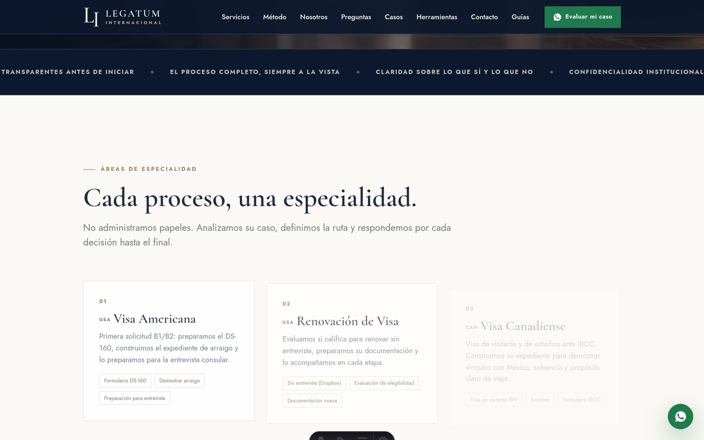 |

The hero states the honest position directly: *"No tramitamos: respondemos por
su caso"* ("We don't process paperwork: we're accountable for your case") — the
differentiation from a gestoría, in the first sentence a visitor reads.

| Service detail — pricing & scope | Service detail — FAQ accordion |
| :---: | :---: |
| 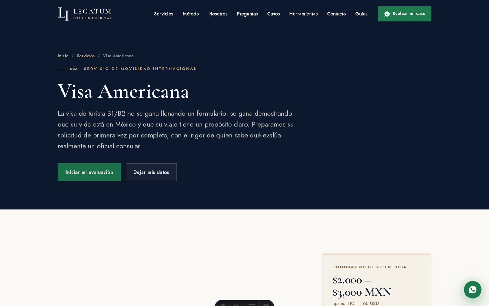 |  |

Every service page publishes its own MXN price range up front — a deliberate
break from the industry norm of hiding fees behind a contact form, treated in
`ai/` as a trust signal rather than a commercial risk.

| The method | Guides (blog) |
| :---: | :---: |
| 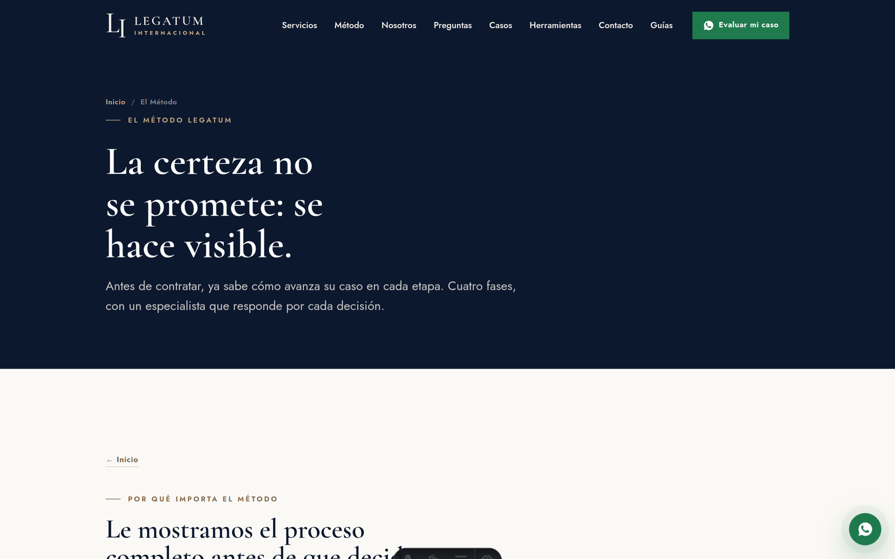 | 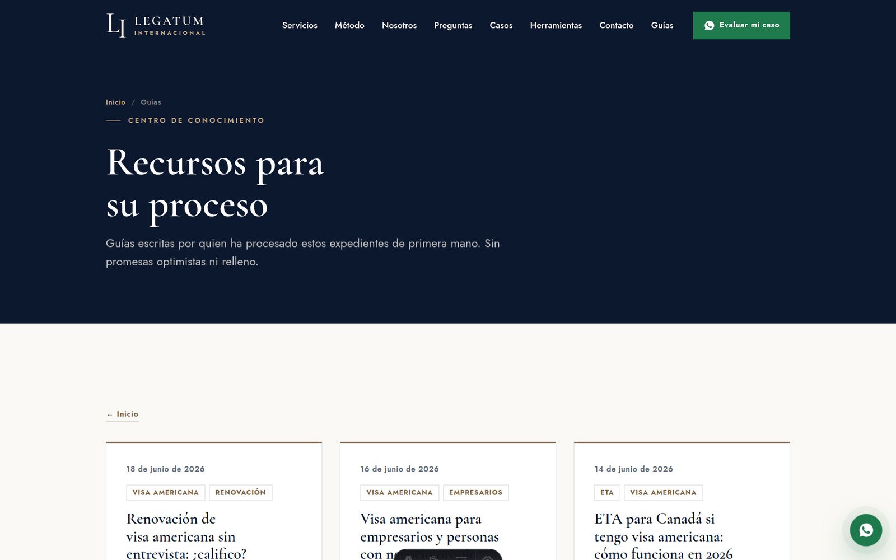 |

| Blog post — with related-service CTA | Contact — form, Turnstile, direct channels |
| :---: | :---: |
| 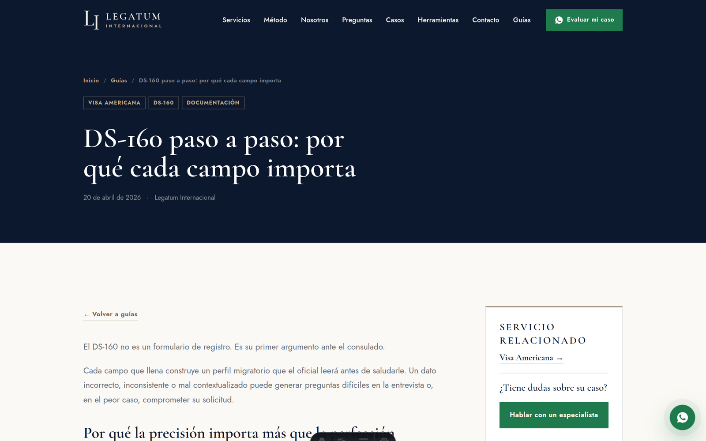 | 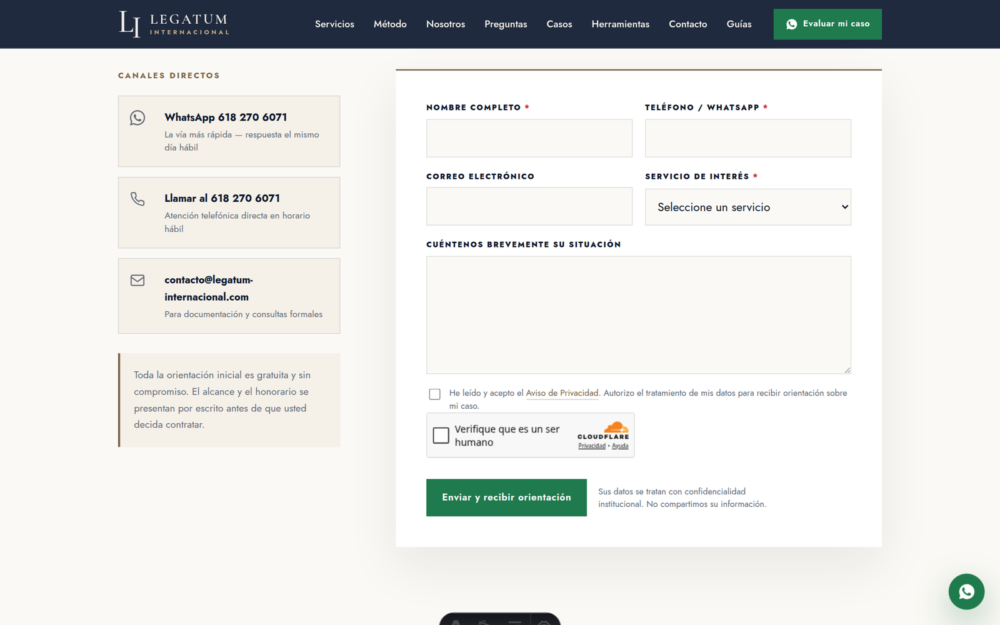 |

| Tools hub | Visa-need simulator |
| :---: | :---: |
| 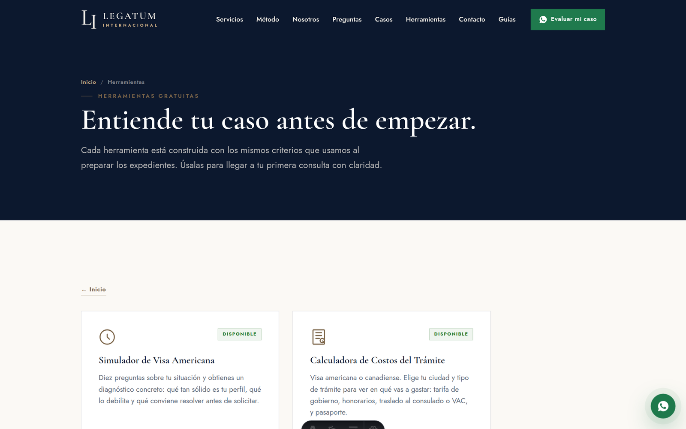 | 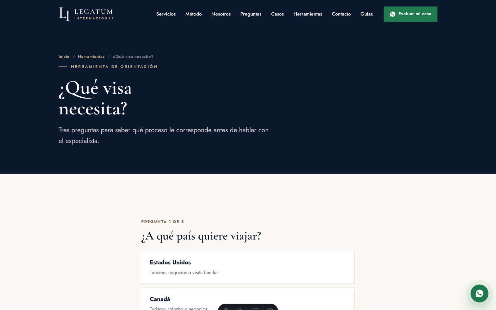 |

Four interactive, client-side-only tools (`src/pages/herramientas/`) let a
visitor self-qualify — which visa, estimated cost, arraigo checklist — before
ever talking to a person, which is exactly the audience the funnel research
identified as most likely to bounce from a plain contact form.

| Ad landing page (noindex, no nav) | Footer — sitemap & legal disclaimer |
| :---: | :---: |
| 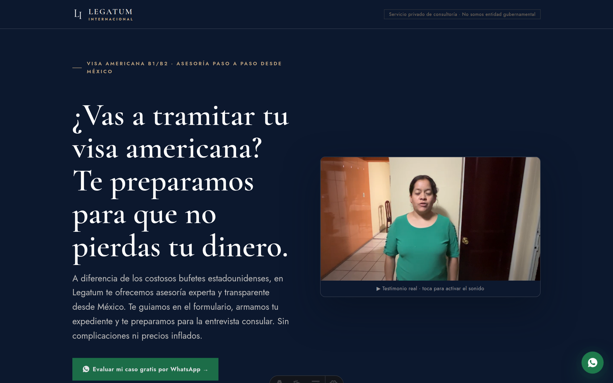 | 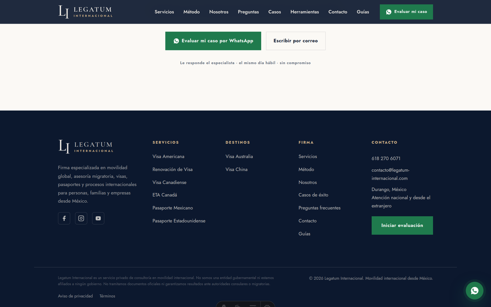 |

The landing page banner states outright *"Servicio privado de consultoría · No
somos entidad gubernamental"* — a Google Ads policy requirement for immigration
services, addressed by design rather than left to a support ticket after a
suspension.

| Mobile — home hero |
| :---: |
|  |

---

## Known limitations

- **No automated tests, no CI.** This is a solo-maintained marketing site with
  no backend state to regress against; correctness is verified by building and
  visually checking the pages that changed. That trade-off stops being right
  the moment the site grows a second contributor or a stateful backend.
- **The Turnstile-siteverify Worker lives in a separate, undocumented
  deployment** (`turnstile-siteverify-legatum`) — this repository depends on it
  but doesn't own or version its source.
- **No blog draft/preview workflow.** Every Markdown file in
  `src/content/blog/` with `draft: false` ships on the next deploy; there's no
  staging environment.
- **Lead-magnet cooldown and popup dismissal are client-side only**
  (`localStorage`/`sessionStorage`) — they prevent accidental duplicate
  submissions from the same browser, not deliberate abuse.

---

## License

Proprietary. All rights reserved — © Legatum Internacional. This is a
commercial client site; the code is published here for portfolio and
collaboration purposes, not under an open-source license.
